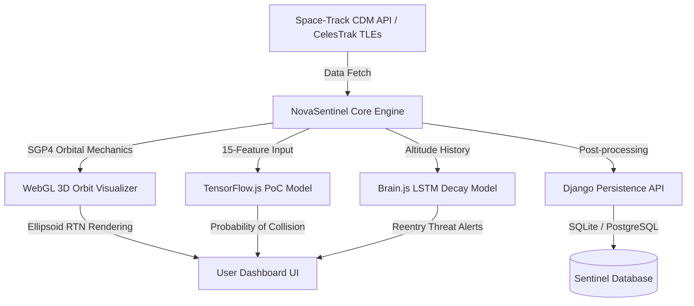

# NovaSentinel 🛰️

> **Real-time Space Situational Awareness (SSA) & Orbital Risk Assessment platform.**
> Visualize 8,000+ active satellites, track close-approach events (CDMs), estimate collision probabilities using local Machine Learning models, and predict orbital decay patterns — all in a premium interactive 3D WebGL dashboard.

---

## 🌌 System Architecture & Data Flow

NovaSentinel is built on a high-performance decoupled architecture designed for heavy calculations and real-time visualization:



- **Frontend Core**: Three.js WebGL rendering engine, SGP4 orbital propagator running inside Web Workers, and local neural network models.
- **Backend API**: Django-based sentinel backend for persistence, audit logging, and coordination.

---

## 🛠️ Tech Stack & Key Technologies

1. **Visual Engine**: [Three.js](https://threejs.org/) for hardware-accelerated WebGL visualization of the planetary sphere, satellite orbits, and RTN (Radial, Transverse, Normal) uncertainty ellipsoids.
2. **Orbital Mechanics**: [Satellite.js](https://github.com/shashwatak/satellite-js) implementing standard SGP4/SDP4 propagators to resolve Keplerian elements from Two-Line Element sets (TLEs).
3. **AI Conjunction Assessment**: [TensorFlow.js](https://www.tensorflow.org/js) running client-side neural networks trained on ESA collision avoidance datasets to compute probability of collision (PoC).
4. **AI Reentry Prediction**: [Brain.js](https://brain.js.org/) sequence-based LSTM recurrent neural network detecting altitude decay patterns and timing reentries.
5. **Persistence**: Django web application with SQLite/PostgreSQL for saving audit logs, tracking rejected TLE data, and persistent CDM records.

---

## ✨ Features

- **Interactive 3D Planetarium**: Real-time position tracking of thousands of satellites, debris, and rocket bodies.
- **Space-Track CDM Integration**: Decodes Conjunction Data Messages (CDMs) using verified fields (`SAT_1_ID`, `SAT_1_NAME`, `MIN_RNG`).
- **Dynamic Search & Discovery**: Real-time indexing (`_cdmSatMap`) mapping CDM virtual stubs so unregistered or non-TLE catalogued satellites (e.g., historical Cosmos, debris) are searchable.
- **Uncertainty Ellipsoid Rendering**: Renders Three.js 3D meshes based on eigenvalues derived from CDM covariance matrices.
- **Fail-safe Risk Triage**: Uses a multi-tiered fallback pipeline (Authoritative CDM PC ➔ Local ML PoC prediction ➔ Miss-distance threshold scaling).
- **Offline Reliability**: Service worker (`sw.js`) caches datasets for continuous terminal operations.

---

## 🚀 Quick Start & Installation

### Prerequisites
- **Node.js** 18.0+
- **Python** 3.10+
- **Space-Track.org** account credentials

---

### 1. Setting up the Django Backend
Navigate to the root project directory and install python dependencies:

```bash
# Set up a virtual environment
python -m venv .venv
# Activate environment
# On Windows:
.venv\Scripts\activate
# On Linux/macOS:
source .venv/bin/activate

# Install requirements
pip install -r requirements.txt
```

#### Database Setup
Create a `.env` file in the root directory (refer to `.env.example`):
```env
SECRET_KEY=your-secret-django-key
DEBUG=True
ALLOWED_HOSTS=localhost,127.0.0.1
SPACETRACK_IDENTITY=your-email@example.com
SPACETRACK_PASSWORD=your-spacetrack-password
```

Run migrations and start the Django server:
```bash
python manage.py migrate
python manage.py runserver
```
The backend API will run on `http://127.0.0.1:8000/`.

---

### 2. Setting up the Frontend
In another terminal session, install Node modules:

```bash
npm install
```

#### Run Dev Server
Launch the Vite development environment:
```bash
npm run dev
```
Open `http://localhost:5173/` in your browser.

---

## 🔬 Space-Track CDM Fields Mapping

To support the public `cdm_public` Space-Track API, the data loader implements the following verified field schema:

| Local Attribute | API Field Name | Details |
|---|---|---|
| **Primary NORAD ID** | `SAT_1_ID` | Core identifier for the asset |
| **Secondary NORAD ID** | `SAT_2_ID` | Threat asset identifier (often debris/R/B) |
| **Primary Name** | `SAT_1_NAME` | Catalog name |
| **Secondary Name** | `SAT_2_NAME` | Threat name |
| **Miss Distance** | `MIN_RNG` | Stored in **metres** (e.g. `52 m`) |
| **Conjunction ID** | `CDM_ID` | Unique Space-Track execution key |
| **Probability of Collision** | `PC` | Standard scientific notation (e.g., `4.72e-3`) |

---

## 🔴 Risk Color & Conjunction Thresholds

Conjunction details are triaged under the standard 18th Space Control Squadron operational bounds:

| Risk Tier | Threshold Limit | System Action | Dashboard Color |
|---|---|---|---|
| **HIGH RISK** | `PoC ≥ 1e-3` | Collision maneuver recommended | 🔴 Red |
| **ELEVATED RISK** | `1e-4 ≤ PoC < 1e-3` | Intensive routine tracking | 🟡 Amber |
| **LOW RISK** | `PoC < 1e-4` | Background logging, low priority | 🟢 Green |
| **UNKNOWN** | N/A | Missing CDM PC or model metrics | 🔵 Blue-Grey |

---

## 📂 Project Directory Structure

```
NovaSentinel/
│
├── dashboard/                 # Frontend distribution files
├── novasentinel_django/       # Core Django project config
│   ├── settings.py
│   └── urls.py
│
├── src/                       # Application Frontend code
│   ├── data/                  # TLE parses, CDM fetches, and CDM covariance math
│   ├── propagation/           # SGP4 Web Workers and propagators
│   ├── ml/                    # TensorFlow.js PoC inference neural networks
│   ├── decay/                 # Brain.js LSTM reentry training models
│   ├── viz/                   # Three.js engines (Scene, Earth, Ellipsoids, Catalogues)
│   ├── ui/                    # UI elements (Cards, Alerts, Search panels, CSV exports)
│   ├── main.js                # Core orchestrator
│   └── style.css              # Glassmorphic cyber CSS system
│
├── scripts/                   # Data generation and offline neural training tools
├── tests/                     # Integrations and mathematical validator test suites
├── manage.py                  # Django administrative script
└── package.json               # Node script launcher
```

---

## 🧪 Operational Commands & Scripts

Run tasks directly using npm scripts:

| Script Command | Description |
|---|---|
| `npm run dev` | Starts the Vite dev server with proxy routing |
| `npm run build` | Builds optimized visual assets into `/dist` |
| `npm test` | Runs the 4 built-in mathematical test suites |
| `npm run test:watch` | Watcher mode for automated test suites |
| `npm run train` | Offline training script for local TF.js PoC model |
| `npm run train-decay` | Training routines for Brain.js LSTM predictions |
| `npm run generate-data` | Fetches fresh CDM entries from Space-Track APIs |

---

## 🧪 Testing Coverage

NovaSentinel uses the native Node.js test runner for lightning-fast validations:

```bash
npm test
```

- **`tleValidator.test.js`**: Validates checksum algorithms, orbital staleness boundaries, and audit log generation.
- **`cdmCovariance.test.js`**: Validates symmetric Jacobi eigenvalues, trace invariants, and uncertainty ellipsoid sizing.
- **`inference.test.js`**: Checks feature vectors, normalization shapes, and Spearman correlation accuracy of the TF.js model.
- **`pipeline.test.js`**: End-to-end simulation of data propagation, feature extraction, and decay sequencing.

---

## 🛡️ License

This project is licensed under the **ISC License**.
